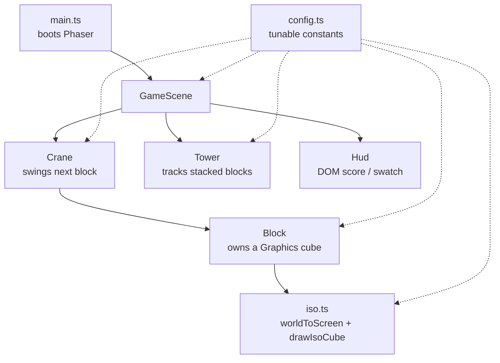

# 2D-PHASER — Code Walkthrough & Notes

A detailed explanation of the **2.5D (Phaser 3)** version of *Lungmen Stacky
Stack*, a Tower Bloxx-like block-stacking game. This document starts with the
big picture (project structure), drills into each file, and then explains
every method in those files.

> Sister project: the `3D-BABYLON/` folder is the true-3D twin of this build.
> Both share the same conceptual structure (`config`, `Crane`, `Tower`,
> `Block`, `GameScene`, `Hud`) so gameplay rules stay easy to mirror.

---

## 1. The big picture

This version is **genuinely 2D** (a flat Phaser canvas) but *fakes* volume to
get a top-down **2.5D dimetric** look — like classic isometric games. The key
idea that makes the whole thing tick:

- **Gameplay is reasoned about in "world units"**, not pixels. There are two
  logical axes:
  - `worldX` — the horizontal **swing axis** (left/right).
  - `worldY` — the **tower height** (how high up the stack a block is).
- **Rendering converts world units to screen pixels** via a projection in
  [src/iso.ts](src/iso.ts), and draws each block as a dimetric cube (a lit top
  face + two shaded side faces). That shading is the *entire* illusion of 3D.

The core gameplay loop is a small state machine:

```
ready ──drop──▶ dropping ──lands on target──▶ (scored) ──▶ ready
                    │
                    └── lands too far off-center ──▶ gameover ──restart──▶ ready
```

Unlike the 3D build (which uses the Havok physics engine), this version uses
**simple kinematic motion**: a falling block just accelerates downward under a
constant gravity until it reaches its target rest height. It's a runnable
*skeleton* — swing, drop, stack, miss-detection, scoring and restart all work,
but there's no real physics/toppling. The code is structured so Phaser's
Matter.js physics could be swapped in later.

### Render & flow at a glance



---

## 2. Project structure

```
2D-PHASER/
├── index.html          # Page shell: #game mount point + DOM HUD + styles
├── package.json        # Deps (phaser) and scripts (dev/build/preview)
├── tsconfig.json       # TypeScript compiler options
├── vite.config.ts      # Dev server (port 5174) + build settings
└── src/
    ├── config.ts       # Central tunable constants (gameplay + rendering)
    ├── iso.ts          # World→screen projection + dimetric cube drawing
    ├── main.ts         # Entry point: creates the Phaser.Game
    ├── entities/
    │   ├── Block.ts    # One stackable block (logic + Graphics cube) + color helpers
    │   ├── Crane.ts    # Holds & swings the next block; releases it on drop
    │   └── Tower.ts    # Tracks settled blocks; reports height & rest positions
    ├── scenes/
    │   └── GameScene.ts # Main loop: drop → fall → land → score/gameover; camera
    └── ui/
        └── Hud.ts      # Thin wrapper over the DOM HUD (score, swatch, overlay)
```

### Responsibility split

| Layer | Files | Job |
| --- | --- | --- |
| Config | `config.ts` | All tunable numbers in one place |
| Projection | `iso.ts` | Turn world units into the 2.5D drawing |
| Entities | `Block`, `Crane`, `Tower` | The pieces of game state |
| Orchestration | `GameScene` | Wire entities together, run the loop |
| Presentation | `Hud`, `index.html` | DOM score/preview/game-over UI |
| Boot | `main.ts` | Start Phaser with the scene |

---

## 3. File-by-file, method-by-method

### 3.1 `index.html`

The HTML shell. Important pieces:

- A `<div id="game">` — **Phaser injects its `<canvas>` here** (configured via
  `parent: "game"` in `main.ts`).
- A `<div id="hud">` overlay containing `#score` and `#nextSwatch` — this is
  the DOM HUD the [Hud](src/ui/Hud.ts) class reads/writes. It lives *outside*
  the canvas and is `pointer-events: none` so clicks pass through to the game.
- Inline CSS makes the page full-window, hides overflow, and styles the
  next-block swatch.
- `<script type="module" src="/src/main.ts">` kicks everything off.

### 3.2 `main.ts` — entry point

[src/main.ts](src/main.ts) builds the Phaser game config and constructs the
game.

- `type: Phaser.AUTO` — let Phaser pick WebGL, falling back to Canvas.
- `parent: "game"` — mount the canvas into the `#game` div.
- `backgroundColor: Config.backgroundColor` — clear color from config.
- `scale` block — `RESIZE` mode + `CENTER_BOTH` so the canvas fills and tracks
  the window size.
- `scene: [GameScene]` — the single scene that runs.
- `new Phaser.Game(config)` — boots it.

No methods here; it's pure configuration + construction.

### 3.3 `config.ts` — tunable constants

[src/config.ts](src/config.ts) exports a single frozen `Config` object
(`as const`). Grouped sections:

| Group | Keys | Meaning |
| --- | --- | --- |
| `block` | `width`, `depth`, `height` | Logical block size in **world units**. `height` is how much vertical room one block occupies in the stack. |
| `crane` | `height`, `swingAmplitude`, `swingSpeed` | How high above the tower top the block hangs, how far it swings (units from center), and swing rate (radians/sec). |
| `drop` | `gravity`, `maxFallSpeed` | Kinematic fall tuning: downward acceleration (units/s²) and a clamp so fast drops stay readable. |
| `rules` | `maxOffsetFromCenter` | If a landed block's center is farther than this (world units) from the tower center, the run ends. |
| `render` | `pxPerUnitX`, `pxPerUnitY`, `cube.*`, `cameraFollowLerp` | The pixels-per-world-unit scale on each axis, the drawn cube dimensions (in screen pixels), and how quickly the camera rises (0..1). |
| `backgroundColor` | — | Canvas clear color. |

Keeping these here is what lets the 2D and 3D builds stay conceptually in
sync — same mental model, different renderer.

### 3.4 `iso.ts` — the 2.5D projection

[src/iso.ts](src/iso.ts) is the heart of the "fake 3D" look. It exports:

#### `interface ScreenPoint`
A simple `{ x, y }` pixel position in world-drawing space (before Phaser's
camera scroll is applied).

#### `worldToScreen(worldX, worldY): ScreenPoint`
Converts a logical world coordinate to a screen pixel position:

- `x = worldX * pxPerUnitX` — swing axis maps straight to horizontal pixels.
- `y = -worldY * pxPerUnitY` — note the **negative sign**. Phaser's screen Y
  grows *downward*, but a taller tower should move *up* the screen, so height
  is negated.

This is the only place the world→screen mapping lives, so everything (blocks,
camera follow) stays consistent.

#### `const Cube`
Convenience getters derived from `Config.render.cube`:
- `halfW` — half the top-face diamond width.
- `halfH` — half the top-face diamond height (2:1 ratio → dimetric look).
- `depth` — pixel height of the visible side faces.

#### `interface Rgb`
An `{ r, g, b }` triple in 0..255.

#### `shade({r,g,b}, factor): number`
Internal helper. Multiplies each channel by `factor`, clamps to 0..255, and
packs the result into a single `0xRRGGBB` integer (the format Phaser's
`fillStyle` wants). Used to draw the three cube faces at different brightnesses.

#### `drawIsoCube(g, baseColor): void`
Draws one dimetric cube into a Phaser `Graphics` object, **centered on that
object's origin** (so the owner just positions the whole Graphics at the
projected point). The geometry:

1. Computes four diamond corners (`top`, `right`, `bottom`, `left`) around the
   origin — the **top face**.
2. Fills the **top face** at full brightness (`factor 1.0`).
3. Fills the **left side face** darkest (`0.6`) — a quad dropping `depth`
   pixels down from the left and bottom corners.
4. Fills the **right side face** at mid shade (`0.8`).
5. Strokes a subtle near-black outline so stacked cubes read as separate.

The brightness difference between the three faces is what sells the volume on a
flat canvas.

### 3.5 `entities/Block.ts` — one stackable block

[src/entities/Block.ts](src/entities/Block.ts) holds both color helpers and the
`Block` class.

#### `interface Rgb`
Re-declared `{ r, g, b }` 0..255 triple (used across the entity layer).

#### `randomBlockColor(): Rgb`
Picks a pleasant random color via HSV with fixed saturation/value
(`0.55`/`0.9`) and random hue — mirroring the 3D build's color pick.

#### `rgbToCss({r,g,b}): string`
Formats an `Rgb` as a CSS `#rrggbb` string. Used to feed the DOM HUD swatch.

#### `hsvToRgb(h, s, v): Rgb`
Internal standard HSV→RGB conversion returning channels scaled to 0..255.

#### `class Block`
Represents a single block: its **logical position** in world units plus the
Phaser `Graphics` object that draws its cube.

Fields:
- `worldX` — position along the swing axis.
- `worldY` — tower-height position of the block's **center**.
- `color` (readonly) — the block's `Rgb`.
- `gfx` (readonly) — the Phaser `Graphics` cube.

Methods:
- **`constructor(scene, worldX, worldY, color)`** — stores the logical
  position/color, creates a `Graphics` object, draws the cube into it via
  `drawIsoCube`, then calls `syncToScreen()` to position it.
- **`syncToScreen()`** — projects `(worldX, worldY)` to pixels with
  `worldToScreen` and moves the `Graphics` there. Also sets the Graphics
  *depth* to `worldY` so **higher blocks render in front** — a newly placed
  block correctly sits on top of the one below it. Call this after changing
  `worldX`/`worldY`.
- **`destroy()`** — disposes the `Graphics` object (used on miss/restart).

### 3.6 `entities/Crane.ts` — swings & releases the next block

[src/entities/Crane.ts](src/entities/Crane.ts). Mirrors the 3D `Crane` minus
the physics body.

Private state:
- `scene`, `tower` — references it needs.
- `heldBlock?` — the currently swinging block (if any).
- `swingTime` — accumulated time driving the sine swing.
- `pendingColor` — color of the *next* block to spawn (so the HUD can preview
  it before it appears).

Methods:
- **`constructor(scene, tower)`** — stores references.
- **`get hasBlock`** — true while a block is loaded and swinging.
- **`get nextColor`** — the pending color, for the HUD preview.
- **`spawnNextBlock()`** — creates a new `Block` at `worldX = 0` and a height of
  `tower.nextRestY + crane.height` (so it hangs above the current top), using
  `pendingColor`. Then rolls a fresh `pendingColor` for the *following* block
  and resets `swingTime`.
- **`update(dt)`** — each frame, advances `swingTime` and sets the held block's
  `worldX = sin(swingTime) * swingAmplitude`, then `syncToScreen()`. No-op if
  nothing is held.
- **`dropBlock(): Block | undefined`** — releases the held block: clears
  `heldBlock` and returns the block so the scene can take ownership and watch
  it fall. Returns `undefined` if nothing was loaded.

### 3.7 `entities/Tower.ts` — the settled stack

[src/entities/Tower.ts](src/entities/Tower.ts). Tracks landed blocks and
exposes the geometry the rest of the game needs.

Private state:
- `blocks: Block[]` — the settled blocks, bottom to top.

Members:
- **`get count`** — number of stacked blocks (== the score).
- **`get surfaceY`** — world Y of the current top surface =
  `count * block.height` (ground top is `y = 0`).
- **`get nextRestY`** — world Y where the next block's **center** should rest =
  `surfaceY + block.height / 2`.
- **`get topBlock`** — the most recently stacked block, or `undefined`.
- **`get centerX`** — the X the next block is judged against: the top block's
  `worldX`, or `0` if the tower is empty (first block judged against center).
- **`addBlock(block)`** — push a newly settled block.
- **`reset()`** — `destroy()` every block and empty the array (on restart).

### 3.8 `scenes/GameScene.ts` — the main loop

[src/scenes/GameScene.ts](src/scenes/GameScene.ts) is the orchestrator. It
extends `Phaser.Scene` and everything is drawn in **world space** (centered on
`x = 0`, ground top at `y = 0`); Phaser's camera scroll handles centering and
panning up.

Types:
- **`type GameState = "ready" | "dropping" | "gameover"`** — the state machine.
- **`interface FallingBlock`** — a released block in flight: the `block`, its
  `velocity` (world units/sec, downward positive), and the `targetRestY` it
  should come to rest at.

Fields:
- `crane`, `tower`, `hud` — the wired-up subsystems.
- `state` — current `GameState`.
- `score` — successful stacks.
- `falling?` — the in-flight block, when `state === "dropping"`.

Methods, in roughly the order they run:

- **`constructor()`** — calls `super("game")` to register the scene key.
- **`create()`** — Phaser lifecycle. Sets the background color, recenters the
  camera, draws the ground, then constructs the `Hud`, `Tower`, and `Crane`,
  spawns the first block (`spawnNext`), registers input, and re-centers the
  camera on window resize.
- **`update(_time, deltaMs)`** — Phaser per-frame hook. Converts ms→seconds,
  updates the crane swing, advances the falling block (if dropping), and runs
  the camera follow.

*Scene building:*
- **`recenterCamera()`** — scrolls so world `x = 0` is horizontally centered and
  the ground sits near the bottom (using `baseScrollY`).
- **`baseScrollY(height)`** — the camera `scrollY` that puts the ground near the
  bottom of the view (`-height * 0.8`).
- **`drawGround()`** — draws a single dimetric diamond as a ground pad for the
  first block, pushed far back in depth.

*Input:*
- **`registerInput()`** — binds pointer-down and the Space key to
  `handleAction`.
- **`handleAction()`** — the single game action: if `gameover` → `restart()`;
  if `ready` and a block is loaded → `dropBlock()`.
- **`dropBlock()`** — takes the block from the crane, creates a `FallingBlock`
  (velocity 0, target = `tower.nextRestY`), and switches to `dropping`.

*Core loop:*
- **`updateFallingBlock(dt)`** — applies kinematic gravity: increases velocity
  (clamped to `maxFallSpeed`), moves the block down. When it reaches/passes
  `targetRestY`, it snaps to the target, syncs visuals, and calls
  `resolveLanding`.
- **`resolveLanding(block)`** — computes the horizontal offset from
  `tower.centerX`. If it exceeds `maxOffsetFromCenter` → `endGame()` (the
  `falling` reference is intentionally kept so `restart` can dispose the
  orphaned block). Otherwise: clear `falling`, add the block to the tower,
  increment + display the score, spawn the next block, and return to `ready`.
- **`endGame()`** — set `gameover` and show the HUD overlay.
- **`restart()`** — reset the tower, destroy any orphaned falling block, zero
  the score, hide the overlay, spawn a fresh block, and return to `ready`.
- **`spawnNext()`** — load the next block on the crane and update the HUD
  preview swatch (`rgbToCss(crane.nextColor)`).

*Camera:*
- **`updateCamera()`** — smoothly lerps `scrollY` so the tower top stays in
  frame once it's tall enough, but never drops below the starting view
  (`Math.min(baseScrollY, followTarget)`), using `cameraFollowLerp`.

### 3.9 `ui/Hud.ts` — the DOM HUD

[src/ui/Hud.ts](src/ui/Hud.ts) keeps all DOM access in one place so the scene
stays focused on gameplay. Identical in spirit to the 3D build's `Hud`.

Fields: `scoreEl`, `nextSwatchEl` (looked up from `index.html`), and an
optional `overlayEl` for the game-over screen.

Methods:
- **`constructor()`** — grabs `#score` and `#nextSwatch`, throwing if either is
  missing (fail fast).
- **`setScore(score)`** — writes the score text.
- **`setNextColor(cssColor)`** — sets the preview swatch's background to a CSS
  color string.
- **`showGameOver(score)`** — builds and appends a fullscreen overlay div with
  "Game Over", the final height, and a restart hint. Guards against creating it
  twice.
- **`hideGameOver()`** — removes the overlay and clears the reference.

---

## 4. Running it

From inside `2D-PHASER/`:

```bash
npm install
npm run dev      # Vite dev server on http://localhost:5174
npm run build    # tsc type-check + production bundle into dist/
npm run preview  # serve the built bundle
```

**Controls:** click or press **Space** to drop the swinging block; after a
game over, click/Space restarts.

---

## 5. Notes, gotchas & extension ideas

- **No real physics.** Falling is pure kinematics (`updateFallingBlock`). To get
  a wobbling, topple-able tower, swap in Phaser's **Matter.js** physics — the
  `FallingBlock`/`resolveLanding` seam is where that would plug in (compare with
  the 3D build's settle-detection in `GameScene`).
- **World units vs. pixels.** Always reason about gameplay in world units and
  let [iso.ts](src/iso.ts) handle pixels. The two scale factors
  (`pxPerUnitX`/`pxPerUnitY`) and the cube dimensions are independent, so you
  can tweak the look without touching gameplay.
- **Depth sorting.** [Block.syncToScreen()](src/entities/Block.ts) sets the
  Graphics depth to `worldY`. If you ever add blocks that share a height,
  you'll need a tiebreaker to keep draw order stable.
- **Miss rule is X-only.** Because this version fakes depth, only horizontal
  (`worldX`) offset is judged. The 3D build also judges Z and "fell below".
- **Difficulty.** Tune `crane.swingSpeed`/`swingAmplitude` (harder aiming) and
  `rules.maxOffsetFromCenter` (tighter landings) in [config.ts](src/config.ts).
