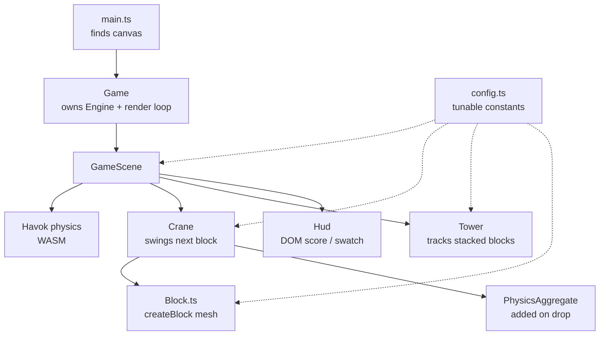

# 3D-BABYLON — Code Walkthrough & Notes

A detailed explanation of the **true-3D (Babylon.js + Havok physics)** version
of *Lungmen Stacky Stack*, a Tower Bloxx-like block-stacking game. This document
starts with the big picture (project structure), drills into each file, and then
explains every method in those files.

> Sister project: the `2D-PHASER/` folder is the 2.5D dimetric twin of this
> build. Both share the same conceptual structure (`config`, `Crane`, `Tower`,
> `Block`, `GameScene`, `Hud`) so gameplay rules stay easy to mirror. The big
> difference: this version uses a **real physics engine (Havok)**, so the tower
> can genuinely wobble and topple.

---

## 1. The big picture

This is a real 3D scene rendered with **Babylon.js** and simulated with the
**Havok** physics engine (compiled to WebAssembly). The flow:

1. A **crane** swings the next block back and forth above the tower.
2. The player drops it; the block becomes a **dynamic rigid body** and falls
   under gravity.
3. The scene **watches the block until it settles** (velocity stays near zero
   for several frames) or times out.
4. If the settled block is close enough to the tower center it's **scored and
   added to the tower**; otherwise it's a **miss** and the run ends.

The core gameplay loop is a small state machine:

```
ready ──drop──▶ dropping ──settles near center──▶ (scored) ──▶ ready
                    │
                    └── drifts too far / falls off ──▶ gameover ──restart──▶ ready
```

Unlike the 2D build (which uses simple kinematic motion), here **physics does
the work** — blocks really collide, slide, and can knock the tower over. The
"did it land well?" decision is made by observing the physics body's linear and
angular velocity rather than a scripted target.

### Architecture at a glance



---

## 2. Project structure

```
3D-BABYLON/
├── index.html          # Page shell: #renderCanvas + DOM HUD + styles
├── NOTES.md            # (this file)
├── package.json        # Deps (@babylonjs/core, @babylonjs/havok) + scripts
├── tsconfig.json       # TypeScript compiler options
├── vite.config.ts      # Dev server (port 5173); excludes Havok WASM from prebundle
└── src/
    ├── config.ts       # Central tunable constants (gameplay + physics + camera)
    ├── Game.ts         # Owns the Babylon Engine and render loop
    ├── main.ts         # Entry point: grabs the canvas and starts Game
    ├── entities/
    │   ├── Block.ts    # createBlock() mesh factory + color helper
    │   ├── Crane.ts    # Holds & swings the next block; releases it as a physics body
    │   └── Tower.ts    # Tracks settled blocks; reports height & rest positions
    ├── scenes/
    │   └── GameScene.ts # Scene setup (camera/light/ground/physics) + main loop
    └── ui/
        └── Hud.ts      # Thin wrapper over the DOM HUD (score, swatch, overlay)
```

### Responsibility split

| Layer | Files | Job |
| --- | --- | --- |
| Config | `config.ts` | All tunable numbers in one place |
| Engine host | `Game.ts` | Create the engine, run the render loop, handle resize |
| Entities | `Block`, `Crane`, `Tower` | The pieces of game state |
| Orchestration | `GameScene` | Build the world, run physics + the loop |
| Presentation | `Hud`, `index.html` | DOM score/preview/game-over UI |
| Boot | `main.ts` | Find the canvas and start the game |

---

## 3. File-by-file, method-by-method

### 3.1 `index.html`

The HTML shell. Important pieces:

- A `<canvas id="renderCanvas">` — Babylon renders into this canvas.
- A `<div id="hud">` overlay with `#score` and `#nextSwatch` — the DOM HUD the
  [Hud](src/ui/Hud.ts) class reads/writes. It's `pointer-events: none` so clicks
  reach the canvas.
- Inline CSS makes the page full-window and styles the next-block swatch.
- `<script type="module" src="/src/main.ts">` starts everything.

### 3.2 `main.ts` — entry point

[src/main.ts](src/main.ts) is tiny: it looks up `#renderCanvas` (throwing if
missing), constructs a `Game` with it, and calls `game.start()` (fire-and-forget
via `void`, since `start` is async).

### 3.3 `Game.ts` — engine host & render loop

[src/Game.ts](src/Game.ts) owns the Babylon `Engine` and delegates all gameplay
to the active scene.

Fields: `engine`, `canvas`, and (after start) `scene` + `gameScene`.

Methods:
- **`constructor(canvas)`** — stores the canvas and creates the Babylon `Engine`
  with `preserveDrawingBuffer`, `stencil`, and `antialias` enabled.
- **`start()`** (async) — creates the `GameScene`, awaits `gameScene.create()`
  (which is async because physics must load the Havok WASM), then starts the
  render loop (`engine.runRenderLoop` → `scene.render()`), and registers the
  window resize handler.
- **`dispose()`** — removes the resize listener and disposes the scene + engine
  (clean teardown).
- **`handleResize`** (arrow field) — calls `engine.resize()` so the canvas keeps
  matching the window. It's an arrow property so `this` stays bound when used as
  an event listener.

### 3.4 `config.ts` — tunable constants

[src/config.ts](src/config.ts) exports a frozen `Config` object (`as const`):

| Group | Keys | Meaning |
| --- | --- | --- |
| `block` | `width`, `height`, `depth`, `mass` | Block dimensions (world units) and its physics mass. |
| `crane` | `height`, `swingAmplitude`, `swingSpeed` | Hang height above the tower top, swing range (units from center), and swing rate (rad/s). |
| `rules` | `settleLinearSpeed`, `settleAngularSpeed`, `settleFrames`, `settleTimeout`, `maxOffsetFromCenter`, `missFallBelow` | When a block counts as "settled" (slow for N frames), how long to wait before giving up, and what counts as a miss (drifted too far, or fell below its target). |
| `camera` | `startRadius`, `startBeta`, `minRadius`, `maxRadius`, `followLerp` | Initial arc-rotate framing, zoom limits, and how fast the camera target rises with the tower. |
| `physics` | `gravity` | World gravity (≈ −19.6 on Y). |

Keeping these here mirrors the 2D build and makes balancing easy.

### 3.5 `entities/Block.ts` — block mesh factory

[src/entities/Block.ts](src/entities/Block.ts) is a pair of free functions
(there's no `Block` *class* here — a block is just a Babylon `Mesh`).

- **`randomBlockColor(): Color3`** — random hue, fixed saturation/value
  (`0.55`/`0.9`) via `Color3.FromHSV`. Matches the 2D build's palette.
- **`createBlock(scene, position, color): Mesh`** — builds a box mesh sized from
  `Config.block`, positions it, gives it a `StandardMaterial` with the chosen
  `diffuseColor` (and low specular), and returns it. **No physics body is
  attached here** — that happens later, when the block is dropped, so held/
  swinging blocks aren't affected by gravity.

### 3.6 `entities/Crane.ts` — swings & releases the next block

[src/entities/Crane.ts](src/entities/Crane.ts).

Type:
- **`interface DroppedBlock`** — a released block: its `mesh` plus the
  `PhysicsAggregate` (the Babylon helper that bundles a body + collision shape).

Private state: `scene`, `tower`, `heldBlock?` (a `Mesh`), `swingTime`,
`pendingColor`.

Methods:
- **`constructor(scene, tower)`** — stores references.
- **`get hasBlock`** — true while a block is loaded and swinging.
- **`get nextColor`** — the pending color, for the HUD preview.
- **`spawnNextBlock()`** — creates a block mesh (no physics) at
  `(0, tower.nextRestY + crane.height, 0)` using `pendingColor`, then rolls a
  fresh `pendingColor` and resets `swingTime`.
- **`update(dt)`** — advances `swingTime` and sets the held mesh's
  `position.x = sin(swingTime) * swingAmplitude`. No-op if nothing is held.
- **`dropBlock(): DroppedBlock | undefined`** — releases the held mesh by
  attaching a `PhysicsAggregate` (box shape, configured `mass`, small
  restitution, high friction), turning it into a **dynamic rigid body**. Returns
  the `{ mesh, aggregate }` so the scene can watch it fall; `undefined` if
  nothing was held.

### 3.7 `entities/Tower.ts` — the settled stack

[src/entities/Tower.ts](src/entities/Tower.ts). Same shape as the 2D build, but
blocks are Babylon `Mesh`es.

- **`get count`** — number of stacked blocks (== score).
- **`get surfaceY`** — top surface world Y = `count * block.height`.
- **`get nextRestY`** — where the next block's center should rest =
  `surfaceY + block.height / 2`.
- **`get topBlock`** — last stacked mesh, or `undefined`.
- **`get centerX`** — the X the next block is judged against (top block's
  `position.x`, or `0` when empty).
- **`addBlock(block)`** — push a settled mesh.
- **`reset()`** — empties the array. **Note:** the caller (the scene) is
  responsible for actually disposing the meshes/physics bodies; `Tower` only
  forgets them.

### 3.8 `scenes/GameScene.ts` — setup + main loop

[src/scenes/GameScene.ts](src/scenes/GameScene.ts) is the orchestrator. Note the
**side-effect imports** near the top (`physicsEngineComponent`,
`standardMaterial`) — Babylon's tree-shakeable core requires importing those
modules to register the features used.

Types:
- **`type GameState = "ready" | "dropping" | "gameover"`** — the state machine.
- **`interface ActiveDrop extends DroppedBlock`** — adds `framesStill` (how many
  consecutive frames the body has been slow), `elapsed` (seconds since drop),
  and `targetRestY` (expected rest height, for the "fell below" check).

Fields: `engine`, `canvas`, `scene`, `camera`, `crane`, `tower`, `hud`, `state`,
`score`, `active?` (the in-flight drop), and `droppedBlocks` (every dropped
block, kept so `restart` can dispose them all).

Methods:

- **`constructor(engine, canvas)`** — stores the engine + canvas.
- **`create()`** (async) — builds the scene: creates the Babylon `Scene` + clear
  color, awaits `enablePhysics()`, then camera/lighting/ground, constructs
  `Hud`/`Tower`/`Crane`, spawns the first block, registers input and the update
  loop, and returns the scene.

*Setup helpers:*
- **`enablePhysics()`** (async) — loads the Havok WASM (`HavokPhysics()`), wraps
  it in a `HavokPlugin`, and enables physics on the scene with the configured
  gravity. This is why `create`/`start` are async.
- **`createCamera()`** — an `ArcRotateCamera` orbiting the tower, with zoom
  limits and mouse control attached.
- **`createLighting()`** — a soft `HemisphericLight` plus a `DirectionalLight`
  for shading/definition.
- **`createGround()`** — a ground mesh with a material, **plus a static
  `PhysicsAggregate` (mass 0)** so the first block has something solid to land
  on.

*Input:*
- **`registerInput()`** — binds pointer-down and the Space key to
  `handleAction`.
- **`handleAction()`** — if `gameover` → `restart()`; if `ready` with a block
  loaded → `dropBlock()`.
- **`dropBlock()`** — gets the `DroppedBlock` from the crane, records it in
  `droppedBlocks`, builds an `ActiveDrop` (counters zeroed, `targetRestY =
  tower.nextRestY`), and switches to `dropping`.

*Loop:*
- **`registerUpdateLoop()`** — adds an `onBeforeRenderObservable` callback that,
  each frame, computes `dt`, updates the crane swing, runs the camera follow,
  and (if dropping) advances `updateActiveDrop`.
- **`updateActiveDrop(dt)`** — the settle detector. Reads the body's linear and
  angular speed; if both are below the `settle*Speed` thresholds it increments
  `framesStill`, otherwise resets it. When `framesStill` reaches `settleFrames`
  (settled) **or** `elapsed` passes `settleTimeout` (gave up), it calls
  `resolveDrop`.
- **`resolveDrop(drop)`** — clears `active`, then judges the landing: a **miss**
  if the horizontal offset from `tower.centerX` exceeds `maxOffsetFromCenter`
  **or** the block fell below `targetRestY - missFallBelow`. On a miss →
  `endGame()`. Otherwise: add the mesh to the tower, bump + display the score,
  spawn the next block, return to `ready`.
- **`endGame()`** — set `gameover` and show the HUD overlay.
- **`restart()`** — dispose every dropped block's aggregate + mesh, clear the
  list, reset the tower, zero the score, hide the overlay, spawn a fresh block,
  return to `ready`.
- **`spawnNext()`** — load the next block on the crane and update the HUD swatch
  (`crane.nextColor.toHexString()`).

*Camera:*
- **`updateCamera()`** — smoothly lerps `camera.target.y` toward
  `tower.surfaceY + 4` (using `camera.followLerp`) so the tower top stays in
  frame as the stack grows.

### 3.9 `ui/Hud.ts` — the DOM HUD

[src/ui/Hud.ts](src/ui/Hud.ts) is functionally identical to the 2D build's HUD.

Fields: `scoreEl`, `nextSwatchEl`, optional `overlayEl`.

Methods:
- **`constructor()`** — grabs `#score` and `#nextSwatch`, throwing if missing.
- **`setScore(score)`** — writes the score text.
- **`setNextColor(cssColor)`** — sets the preview swatch background.
- **`showGameOver(score)`** — builds/append a fullscreen "Game Over" overlay with
  the final height and a restart hint (guarded against double-creation).
- **`hideGameOver()`** — removes the overlay and clears the reference.

---

## 4. Running it

From inside `3D-BABYLON/`:

```bash
npm install
npm run dev      # Vite dev server on http://localhost:5173
npm run build    # tsc type-check + production bundle into dist/
npm run preview  # serve the built bundle
```

**Controls:** click or press **Space** to drop the swinging block; drag to orbit
the camera, scroll to zoom; after a game over, click/Space restarts.

> **Havok WASM:** Havok ships as a WebAssembly module. `vite.config.ts` excludes
> `@babylonjs/havok` from dependency pre-bundling so the WASM loads correctly in
> dev.

---

## 5. Notes, gotchas & extension ideas

- **Physics is real here.** Landing quality is judged by *observing* the body's
  velocity (`updateActiveDrop`), not by a scripted target like the 2D build. A
  badly placed block can slide, wobble, and topple the tower.
- **Bodies attach on drop, not on spawn.** [Block.createBlock](src/entities/Block.ts)
  makes a plain mesh; the `PhysicsAggregate` is added in
  [Crane.dropBlock](src/entities/Crane.ts). This keeps the swinging block immune
  to gravity until released.
- **Side-effect imports matter.** Babylon's core is tree-shakeable; forgetting
  the `physicsEngineComponent` / `standardMaterial` imports in `GameScene` would
  break physics or materials at runtime even though types compile fine.
- **Tower.reset only forgets.** Disposing meshes/aggregates is the scene's job
  (`restart`). If you stop tracking a block in `droppedBlocks`, it will leak.
- **Settle tuning.** `settleFrames`, `settleLinearSpeed`, `settleAngularSpeed`,
  and `settleTimeout` in [config.ts](src/config.ts) trade responsiveness against
  false "settled" calls on a still-wobbling tower.
- **Miss rule.** Judged on X offset and "fell below"; you could extend
  `resolveDrop` to also consider Z drift for a fuller 3D challenge.
